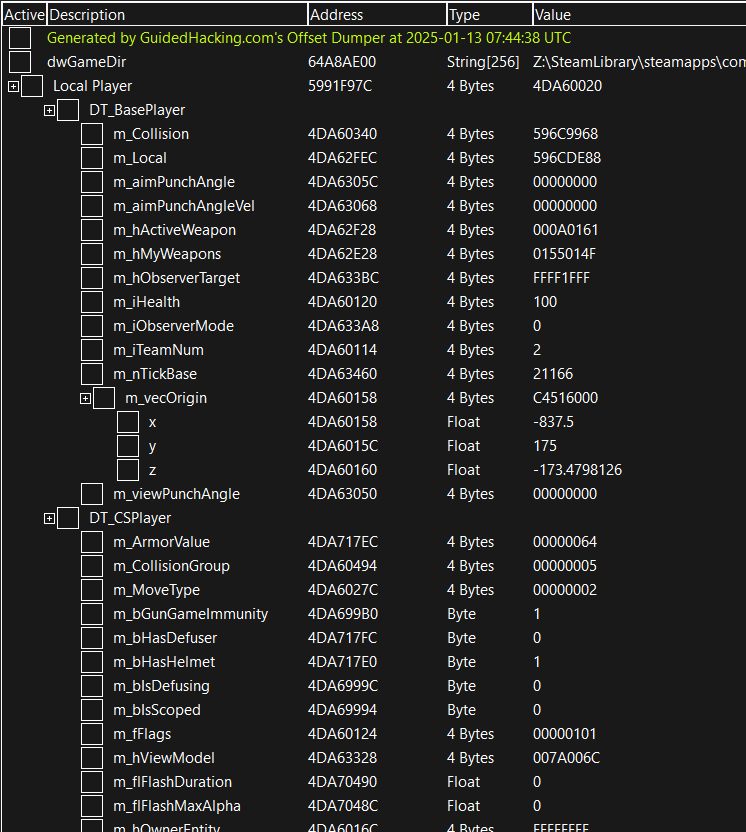

# Guided Hacking Offset Dumper aka GH Offset Dumper

Version 1.1

### Why is GH Offset Dumper Better Than All Others?

- Three dump file formats: .hpp (C/C++ header), .ct (Cheat Engine Table), .rcnet (ReClass.NET)
- .hpp header file is easily included in your project, so you can use offsets. Also, it has comments showing modules and base objects of signatures and netvars respectively.
- .ct Cheat Engine Table shows the Local Player and Entity List. At the bottom, all signatures and netvars are organized in a nice format.
- .rcnet ReClass.NET: All netvar tables are organized as classes.

### Dumping From Disk

- Supports dumping from a main exe, and multiple modules at once.
- Supports relative branch signatures
- Does not support netvars when dumping from disk

#





#

### What does it do

Externally scan a process for signatures and dump the relative offsets to a header file which is easy to incorporate into your Visual Studio project. When an update is released for a game, you run the dumper to get the latest offsets.

### Releases/Downloads

The **Releases** section of GitHub contains GH offset dumper executables and dump files for CS:GO.

### Why

Scrubs don't know how to pattern scan so they manually update their offsets in their game hacks after running an offset dumper like this.

### How to use normally

1. Put config.json in the same folder as the dumper.
2. Run the game.
3. If the game uses the source engine you should run GH-Offset-Dumper-64.exe if the game is 64 bits, or GH-Offset-Dumper-32.exe if the game is 32 bits, otherwise netvars will not be dumped. If the game does not use the source engine, you can use either one.
4. Include the generated .hpp file in your project.

### How to use with files from disk

1. Update your config.json with our example, it can be found below or in the `diskSample.json` file.
2. Update the `exeFile` field with the path to your exe on disk.
3. If you require any modules, make sure you add them and put their path in the `additionalModules` array.
4. Add any signaures you need.
5. Run the tool & the offset file will be generated.

### Misc

You can drag and drop a config file on the exe to parse it. If you use the given `config.json`, the dumper will dump the WinMain address out of notepad as an example. The old csgo is in the `old_csgo.json` file.

### How to use the GHDumper.h library

To use the dumper as a library in your project, you need GHDumper.h and [json.hpp](https://github.com/nlohmann/json).

```cpp
#include <fstream>
#include "json.hpp"
#include "GHDumper.h"

int main()
{
	// load json
	std::ifstream file("config.json");
	auto config = nlohmann::json::parse(file);

	// dump as std::unordered_map<std::string, ptrdiff_t>
	auto signatures = gh::DumpSignatures(config);
	auto netvars = gh::DumpNetvars(config, signatures);

	// format files as std::string
	auto hpp = gh::FormatHeader(config, signatures, netvars);
	auto ct = gh::FormatCheatEngine(config, signatures, netvars);
	auto xml = gh::FormatReclass(config, netvars);

	// save files or do whatever
	// ...
}
```

### How to dump from game dumps?

Dumping from a game exe on disk is simple. You need to adjust your config.json file, and specify the path to your dump. You can also add more than one modules to this, so if you want to scan through many files on disk at once you can.

```jsonc
{
  "fileonly": true, // specify file only mode
  "relativeByDefault": true, // treats all signatures that don't specify if they're relative or not as relative
  "exefile": "C:/Path/To/Game/dump.exe", // supply path to dumped game
  "executable": "GameName.exe",
  "filename": "GameName",
  "additionalModules": [
    // you'll need to load every module you want to scan
    {
      "name": "AnotherModule",
      "path": "C:/Path/To/Module/something.dll" // this can be another exe or dll
    }
  ],
  "signatures": [
    {
      "name": "TestSig123",
      "pattern": "E9 ? ? ? ? 48 8B 8A ? ? ? ? 48 83 C1 28 E9 ? ? ? ? 40 55",
      "rva": true, // specify this is a relative branch signature
      "opLoc": 1, // this is an optional value, its defaulted to 1
      "opLength": 5, // this is an optional value, its defaulted to 5
      "module": "AnotherModule" // if this is not specified it will default to GameName.exe
    },
    {
      "name": "MyseriousFunction",
      "pattern": "E8 ? ? ? ? 48 8B F8 48 89 44 24 ? 48 85 DB"
    }
  ]
}
```

### How is this different from HazeDumper?

This dumper was inspired by [hazedumper](https://github.com/frk1/hazedumper) so thank you to frk1, rN' and the other contributors to that project.

I started learning Rust when messing with HazeDumper and I decided we needed a C++ version, I also wanted to extend the functionality.

GH Dumper will do the same thing as HazeDumper with the addition of dumping ReClass files and Cheat Engine Tables.

Our dumper uses the same json config file format, so they are interchangeable.

### Notes

- The main code is `GHDumper.h/GHDumper.cpp` (the dumper library) and `main.cpp` (uses the dumper library).
- `json.hpp` is a dependency of `GHDumper.h`.
- `zip.h`, `zip.c` and `miniz.h` are dependencies of `main.cpp`. They are used to make a ZIP file when creating `.rcnet`.
- If any value is missing from the output header file, it is possible the signature is outdated and thus the pattern scan returned 0.
- In CS:GO, joining a match may cause the dumper to fail. Restarting CS:GO should solve it.\
- Netvars are not supported when dumping signatures from disk.
- You can default all signatures to be relative (that don't specify otherwise) by using setting `relativeByDefault` to `true`.
- Provided is a sample to start dumping from disk with, and the old csgo style config for reference.

### TODO

- Make an internal version
- Add CSS functionality
- Other ideas to make it kewl

### Credits

Thank you to frk1, rN' and the contributors to [hazedumper](https://github.com/frk1/hazedumper)

Thank you to nlohmann and the contributors of [json.hpp](https://github.com/nlohmann/json)

<h3>Official GH Courses</h3>
<ul>
	<li><a href="https://guidedhacking.com/ghb" target="_blank">The Game Hacking Bible</a>&nbsp;- a massive 70 chapter Game Hacking Course</li>
	<li><a href="https://guidedhacking.com/threads/squally-cs420-game-hacking-course.14191/" target="_blank">Computer Science 420</a>&nbsp;- an eight chapter lecture on CS, Data Types &amp; Assembly</li>
	<li><a href="https://guidedhacking.com/forums/binary-exploit-development-course.551/" target="_blank">Binary Exploit Development</a>&nbsp;- a 9 chapter series on exploit dev&nbsp;from a certified OSED</li>
	<li><a href="https://guidedhacking.com/forums/game-hacking-shenanigans/" target="_blank">Game Hacking Shenanigans</a>&nbsp;- a twenty lesson Cheat Engine hacking course</li>
	<li><a href="https://guidedhacking.com/threads/python-game-hacking-tutorial-1-1-introduction.18695/" target="_blank">Python Game Hacking Course</a>&nbsp;- 7 chapter external &amp; internal python hack lesson</li>
	<li><a href="https://guidedhacking.com/threads/python-game-hacking-tutorial-2-1-introduction.19199/" target="_blank">Python App Reverse Engineering</a>&nbsp;- Learn to reverse python apps in 5 lessons</li>
	<li><a href="https://guidedhacking.com/threads/web-browser-game-hacking-intro-part-1.17726/" target="_blank">Web Browser Game Hacking</a>&nbsp;- Hack javascript games with this 4 chapter course</li>
	<li><a href="https://guidedhacking.com/forums/roblox-exploit-scripting-course-res100.521/" target="_blank">Roblox Exploiting Course</a>&nbsp;- 7 Premium Lessons on Hacking Roblox</li>
	<li><a href="https://guidedhacking.com/forums/java-reverse-engineering-course-jre100.538/" target="_blank">Java Reverse Engineering Course</a>&nbsp;- 5 chapter beginner guide</li>
	<li><a href="https://guidedhacking.com/forums/java-game-hacking-course-jgh100.553/" target="_blank">Java Game Hacking Course</a>&nbsp;- 6 Chapter Beginner Guide</li>
</ul>

GuidedHacking® - The Game Hacking Bible® - © 2025 Guided Hacking LLC. All Rights Reserved.
