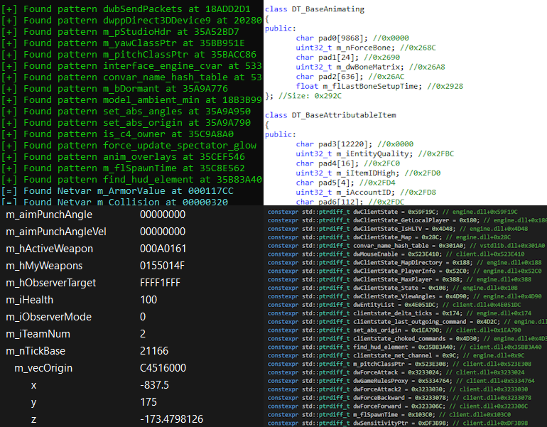

# **Guided Hacking Offset Dumper**

A modernized signature scanner that works with any game. This tool can very quickly generate full offset headers for any game on disk or during runtime, without changing any of the code. You can have separate JSON files for each game and project, which are to be dragged and dropped on the dumper.



## **How to use it**

1. Run the game.
2. If the game uses the source engine, you should run `GH-Offset-Dumper-64.exe` if the game is 64 bits, or `GH-Offset-Dumper-32.exe` if the game is 32 bits; otherwise, netvars will not be dumped. If the game does not use the source engine, you can use either one.
3. Drag and drop your `config.json` on the exe.
4. Include the generated `.hpp` file in your project.

## **How to dump from disk**

1. Update your `config.json` with our example, which can be found below or in the `diskSample.json` file, make sure `fileonly` is set to true.
2. Update the `exeFile` field with the path to your exe on disk.
3. If you require any modules, make sure you add them and put their path in the `additionalModules` array.
4. Add any signatures you need.
5. Drag and drop your config file on the dumper.

## **Dumping From Disk Features**

* Supports dumping from a main exe and multiple modules (DLLs) at once.
* Supports relative branch signatures
* Does not support netvars when dumping from disk

## **How to use the GH Offset Dumper library**

Using the GH Offset Dumping Library is very easy. If you're working externally, the offset dumper is 1 line of code to get set up. When you use the `ParseCommandLine` function from the library, it will automatically support dragging and dropping JSON files onto your output exe. This function can be easily modified if you need more control. You need to link your project to the static library, and add the include directory to your project.

```cpp
#include <iostream>
#include <GHDumper.h>
#include <GHFileHelp.h>

int main(int argc, const char** argv)
{
	if (!gh::ParseCommandLine(argc, argv))
	{
		printf("[-] Failed to dump offsets.\n");
		return 1;
	}
	
	printf("[+] Successfully dumped offsets!\n");
	return 0;
}
```

## **How to dump from game dumps?**

Dumping from a game exe on disk is simple. You need to adjust your `config.json` file and specify the path to your dump. You can also add more than one module to this, so if you want to scan through many files on disk at once, you can.

```jsonc
{
  "fileonly": true, // specify file only mode
  "relativeByDefault": true, // treats all signatures that don't specify if they're relative or not as relative
  "exefile": "C:/Path/To/Game/dump.exe", // supply path to dumped game
  "executable": "GameName.exe",
  "filename": "GameName",
  "additionalModules": [
    {
      "name": "AnotherModule",
      "path": "C:/Path/To/Module/something.dll"
    }
  ],
  "signatures": [
    {
      "name": "TestSig123",
      "pattern": "E9 ? ? ? ? 48 8B 8A ? ? ? ? 48 83 C1 28 E9 ? ? ? ? 40 55",
      "rva": true,
      "opLoc": 1,
      "opLength": 5,
      "module": "AnotherModule"
    },
    {
      "name": "MysteriousFunction",
      "pattern": "E8 ? ? ? ? 48 8B F8 48 89 44 24 ? 48 85 DB"
    }
  ]
}
```

## Notepad Disk Example
This will dump the WinMain from Notepad on disk.
```json
{
  "fileonly": true, 
  "relativeByDefault": true, 
  "exefile": "C:/Windows/System32/notepad.exe", 
  "executable": "notepad.exe",
  "filename": "notepad",
  "signatures": [
    {
      "name": "WinMain",
      "pattern": "E8 ? ? ? ? 8B D8 E8 ? ? ? ? 84 C0",
      "rva": true,
      "opLoc": 1,
      "opLength": 5
    }
  ]
}
```

```bash
[+] Loaded notepad.exe at 0x000001DD07D264B0 (0x38000)
[~] Target: notepad.exe
[!] Dumping From Disk
[+] Found pattern WinMain at 000001DD07D49FF1
        [?] Processing Relative Branch
        [+] Resolved call location: 000001DD07D312EC
[+] Successfully dumped offsets!
```

## **Why is GH Offset Dumper Better Than All Others?**

* Three dump file formats: `.hpp` (C/C++ header), `.ct` (Cheat Engine Table), `.rcnet` (ReClass.NET)
* `.hpp` header file is easily included in your project, so you can use offsets. Also, it has comments showing modules and base objects of signatures and netvars, respectively.
* `.ct` Cheat Engine Table shows the Local Player and Entity List. At the bottom, all signatures and netvars are organized in a nice format.
* `.rcnet` ReClass.NET: All netvar tables are organized as classes.
* Supports dumping signatures from disk.

## **What does it do**

Externally scan a process for signatures and dump the relative offsets to a header file, which is easy to incorporate into your Visual Studio project. When an update is released for a game, you run the dumper to get the latest offsets.

## **Why**

Scrubs don't know how to pattern scan, so they manually update their offsets in their game hacks after running an offset dumper like this. It's smarter to generate headers like this, rather than send someone your code with perfect auto-updating offsets built in.

## **Misc**

You can drag and drop a config file on the exe to parse it. If you use the given `config.json`, the dumper will dump the WinMain address out of Notepad as an example. The old CSGO is in the `oldCsgo.json` file.

Dumped offsets will be placed in a directory named `output`.


## **How is this different from HazeDumper?**

This dumper was inspired by [hazedumper](https://github.com/frk1/hazedumper), so thank you to frk1, rN', and the other contributors to that project.

I started learning Rust when messing with HazeDumper, and I decided we needed a C++ version. I also wanted to extend the functionality.

**GH Dumper will do the same thing as HazeDumper** with the addition of dumping ReClass files and Cheat Engine Tables.
Our dumper uses the same JSON config file format, so they are interchangeable.

## **Notes**

* The main code is `GHDumper.h/GHDumper.cpp` (the dumper library).
* `json.hpp` is a dependency of `GHDumper.h`.
* `zip.h`, `zip.c`, and `miniz.h` are dependencies used to make a ZIP file when creating `.rcnet`.
* If any value is missing from the output header file, it is possible that the signature is outdated, and thus the pattern scan returned 0.
* In CS\:GO, joining a match may cause the dumper to fail. Restarting CS\:GO should solve it.
* Netvars are not supported when dumping signatures from disk.
* You can default all signatures to be relative (that don't specify otherwise) by using the setting `relativeByDefault` to `true`.
* Provided is a sample to start dumping from disk with, and the old csgo style config for reference.

## **TODO**

* Make an internal version
* Add CSS functionality
* Other ideas to make it kewl

## **Releases/Downloads**

[https://guidedhacking.com/resources/guided-hacking-offset-dumper-gh-offset-dumper.51/](https://guidedhacking.com/resources/guided-hacking-offset-dumper-gh-offset-dumper.51/)

## **Credits**

Thank you to
- frk1, rN' and the contributors to [hazedumper](https://github.com/frk1/hazedumper)
- nlohmann and the contributors of [json.hpp](https://github.com/nlohmann/json)
- tobias and the contributors of the single header [base64](https://github.com/tobiaslocker/base64) library

<h3>Official GH Courses</h3>
<ul>
	<li><a href="https://guidedhacking.com/ghb" target="_blank">The Game Hacking Bible</a>&nbsp;- a massive 70 chapter Game Hacking Course</li>
	<li><a href="https://guidedhacking.com/threads/squally-cs420-game-hacking-course.14191/" target="_blank">Computer Science 420</a>&nbsp;- an eight chapter lecture on CS, Data Types &amp; Assembly</li>
	<li><a href="https://guidedhacking.com/forums/binary-exploit-development-course.551/" target="_blank">Binary Exploit Development</a>&nbsp;- a 9 chapter series on exploit dev&nbsp;from a certified OSED</li>
	<li><a href="https://guidedhacking.com/forums/game-hacking-shenanigans/" target="_blank">Game Hacking Shenanigans</a>&nbsp;- a twenty lesson Cheat Engine hacking course</li>
	<li><a href="https://guidedhacking.com/threads/python-game-hacking-tutorial-1-1-introduction.18695/" target="_blank">Python Game Hacking Course</a>&nbsp;- 7 chapter external &amp; internal python hack lesson</li>
	<li><a href="https://guidedhacking.com/threads/python-game-hacking-tutorial-2-1-introduction.19199/" target="_blank">Python App Reverse Engineering</a>&nbsp;- Learn to reverse python apps in 5 lessons</li>
	<li><a href="https://guidedhacking.com/threads/web-browser-game-hacking-intro-part-1.17726/" target="_blank">Web Browser Game Hacking</a>&nbsp;- Hack javascript games with this 4 chapter course</li>
	<li><a href="https://guidedhacking.com/forums/roblox-exploit-scripting-course-res100.521/" target="_blank">Roblox Exploiting Course</a>&nbsp;- 7 Premium Lessons on Hacking Roblox</li>
	<li><a href="https://guidedhacking.com/forums/java-reverse-engineering-course-jre100.538/" target="_blank">Java Reverse Engineering Course</a>&nbsp;- 5 chapter beginner guide</li>
	<li><a href="https://guidedhacking.com/forums/java-game-hacking-course-jgh100.553/" target="_blank">Java Game Hacking Course</a>&nbsp;- 6 Chapter Beginner Guide</li>
</ul>

GuidedHacking® - The Game Hacking Bible® - © 2025 Guided Hacking LLC. All Rights Reserved.
